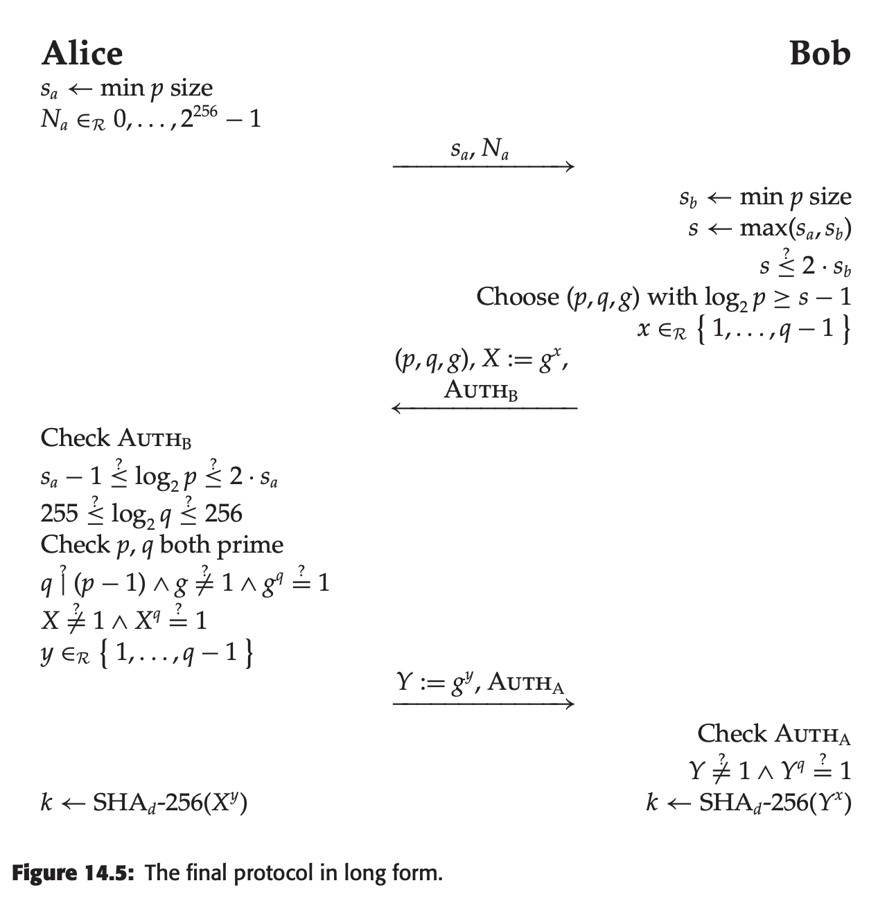

# 2023-01-27
The notes & assigned homework are [here](https://uncloak.org/courses/rust+cryptography+engineering/course-2023-01-27+Session+9+Notes).

## Assigned reading

* [x] Most of chapter 13 may be skipped, though 13.5.6 on replay attacks is worth covering.
* [x] Chapter 14 on key negotiation explores a protocol to obtain a secret session key from an existing secret shared key, for forward secrecy
* [x] It's worth a light read of chapter 15 & 16. 

## Homework related to protocol building

* [x] **TLS 1.3 implements session resumption, allowing previously connected parties to re-use a previously used shared secret key. Does the session resumption protocol obtain forward secrecy? (Not answered in the book, use the internet).**

Looking around on the internet, the following links are useful to understand session resumption:
* [TLS Session Resumption: Full-speed and Secure](https://blog.cloudflare.com/tls-session-resumption-full-speed-and-secure/) (Cloudflare Blog)
* Search for "0-RTT resumption" in [A Detailed Look at RFC 8446 (a.k.a. TLS 1.3)](https://blog.cloudflare.com/rfc-8446-aka-tls-1-3/) (Cloudflare blog)

Now, what is forward secrecy exactly? It's the ability to protect past session, even if the long-term secrets are compromised in the future. From that point of view, the resumption protocol achieves forward secrecy: past sessions, including sessions that have resumed using the protocol, are secure against a compromise of the long-term server or client keys.

* [x] **List the checks performed in the protocol in chapter 14 on page 235. Could this protocol be vulnerable to a Man-in-the-Middle attack?**

Here's the protocol from the book:

The checks performed are:
* Bob verifies `s < 2*sb`
* **Alice checks AuthB**
* Alice checks `sa -1 <= log2(p) <= 2*sa`
* Alice checks `255 <= log2(q) <= 256`
* Alice checks (p, q) are prime
* Alice checks q is a divisor of (p-1)
* Alice checks g != 1 and g^q == 1
* Alice checks X != 1 and X^q == 1
* **Bob checks AuthA**
* Bob checks Y != 1 and Y^q == 1

In this protocol, the only relevant checks to prevent Man-in-the-Middle attacks are "Auth" checks (bolded). From page 230 ("An Authentication Convention"):

> In our protocols, every time a party sends an authentication, the authentication data consists of all the data exchanged so far: all the previous messages, and all the data fields that precede the authentication in the authenticator’s message. The authenticator will also cover (be computed over) the identities of the communicants.

This means `AuthB` contains Alice's identity, Bob's identity, sa, Na, (p, q, g), and X. Similarly, `AuthA` contains Bob's identity, Alice's identity,  sa, Na, (p, q, g), X, and Y.

This thwarts any risk of Man-in-the-Middle attacks assuming Alice and Bob can successfully authenticate their public keys in the first place.

* [x] **Using the internet, find at least one method used for nonce-generation, besides a counter. Describe this method for nonce generation in the Discord study-group-main-channel chat.**

Methods to generate nonces:
* Large random number: this is useful for secret nonces used in e.g. ECDSA signatures. Good randomness needed!
* UUIDs using PRNG or true CSPRNGs: good for DB identifiers, request IDs, etc
* Current timestamp in nanoseconds: has the advantage of being monotonic and unique
* Current Bitcoin, Ethereum, Solana block hash: has the advantage of providing global, decentralized agreement (similar to using a timestamp). The added bonus is unpredictability. This is useful for protocol which need proof of liveness, i.e. prove that you know X as of block Y.